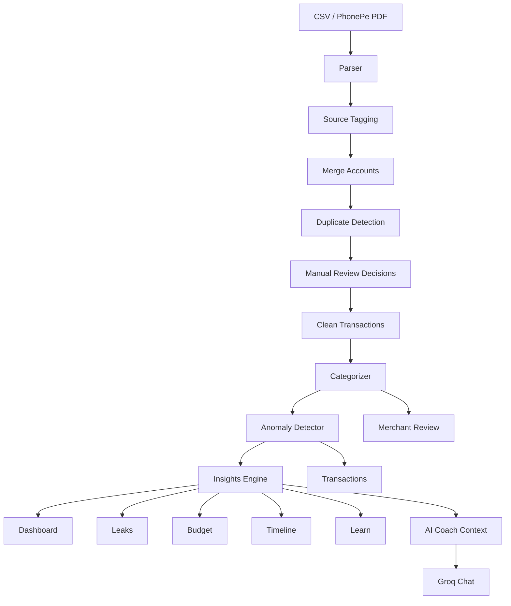

# Clarity Money OS


Clarity Money OS is a Streamlit personal finance app that analyzes UPI, wallet, bank CSV, and PhonePe PDF statements. It turns raw transaction history into categories, merchant insights, anomaly flags, budget projections, duplicate review, leak detection, timeline storytelling, and AI-powered coaching.

## Features

- CSV and PhonePe PDF statement upload
- Multi-account import and merge
- Cross-source duplicate detection and manual review
- Merchant categorization with user override rules
- Category summaries and top merchants
- Anomaly detection for unusual and suspicious transaction patterns
- Savings rate, spend velocity, weekend spend, and monthly trend analytics
- Subscription and recurring payment detection
- Silent leak cards for subscriptions, food drift, BNPL pressure, and large unusual payments
- Budget tracker with monthly overview, category budgets, projections, and alerts
- Financial timeline with month-by-month behavioral narrative
- Groq-powered AI Coach using structured financial context

## Tech Stack

- Python
- Streamlit
- pandas
- NumPy
- Plotly
- SciPy
- RapidFuzz
- pdfplumber
- Groq SDK

## Project Structure

```text
.
├── app.py
├── requirements.txt
├── MoneyOS_Logo.png
├── config/
│   ├── categories.json
│   └── user_overrides.json
├── data/
│   ├── sample_transactions.csv
│   ├── demo_same_account_export_a.csv
│   └── demo_same_account_export_b.csv
├── docs/
│   ├── README.md
│   ├── user-manual.md
│
└── modules/
    ├── ai_advisor.py
    ├── anomaly_detector.py
    ├── budget_tracker.py
    ├── categorizer.py
    ├── csv_format_guide.py
    ├── deduplicator.py
    ├── insights.py
    ├── merchant_review_ui.py
    ├── parser.py
    ├── phonepe_pdf_parser.py
    ├── user_overrides.py
    └── pages/
```

## Installation

### 1. Clone or open the project

```bash
cd "C:\Users\hites\UPI Analyzer Financial Coach"
```

### 2. Create a virtual environment

```bash
python -m venv venv
```

### 3. Activate it

```bash
venv\Scripts\activate
```

For macOS or Linux:

```bash
source venv/bin/activate
```

### 4. Install dependencies

```bash
pip install -r requirements.txt
```

### 5. Optional: configure Groq for AI Coach

Set an environment variable:

```bash
set GROQ_API_KEY=your_key_here
```

Or add it to Streamlit secrets:

```toml
GROQ_API_KEY = "your_key_here"
```

### 6. Run the app

```bash
streamlit run app.py
```

Open:

```text
http://localhost:8501
```

## Usage

### Use sample data

Click `Explore demo first` on the landing page.

### Use demo duplicate-review data

Upload:

```text
data/demo_same_account_export_a.csv
```

Then add this as an extra account:

```text
data/demo_same_account_export_b.csv
```

This flow showcases:

- multi-source merge
- duplicate candidates
- merchant categorization
- dashboard insights
- timeline storytelling
- leak detection

### Use your own CSV

Recommended columns:

```csv
Date,Description,Amount,Type,UPI_ID,Balance
2024-01-02,Zomato Order,-450.00,Debit,zomato@icici,24550.00
2024-01-07,Salary Credit,85000.00,Credit,employer@hdfcbank,106342.00
```

The parser also recognizes common aliases such as:

- `Txn Date`
- `Transaction Date`
- `Debit Amount`
- `Credit Amount`
- `Dr Amount`
- `Cr Amount`
- `Narration`
- `Particulars`
- `UPI ID`
- `VPA`
- `Reference`
- `Txn ID`

## Architecture



## Core Modules

### `modules/parser.py`

Normalizes transaction CSV files into a common schema:

- `date`
- `description`
- `amount`
- `type`
- `upi_id`
- `ref_no`
- `balance`
- `month`
- `day_of_week`
- `hour`
- `has_time`
- `week`

### `modules/phonepe_pdf_parser.py`

Extracts transactions from text-based PhonePe statement PDFs using `pdfplumber`.

### `modules/deduplicator.py`

Tags sources, merges files, detects cross-source duplicate candidates, and applies manual decisions.

Detection methods include:

- exact reference match
- exact transaction ID match
- exact timestamp and amount match
- fuzzy description match
- merchant match duplicate

### `modules/categorizer.py`

Categorizes debit transactions using:

- user overrides
- category keyword config
- merchant extraction
- fallback category

### `modules/anomaly_detector.py`

Adds anomaly columns such as:

- `is_zscore_anomaly`
- `is_iqr_anomaly`
- `is_odd_hour`
- `is_round_number`
- `is_new_merchant`
- `is_frequency_spike`
- `is_duplicate`
- `anomaly_score`
- `anomaly_severity`

### `modules/insights.py`

Computes:

- month-over-month trends
- day-of-week patterns
- weekend vs weekday spend
- subscriptions
- savings rate
- guilt merchant
- spend velocity
- biggest month-over-month jump

### `modules/budget_tracker.py`

Computes category budget status, monthly overview, projected month-end spend, and budget alerts.

### `modules/ai_advisor.py`

Builds a structured financial context and powers the AI Coach with Groq.

## Pages

Page renderers live in `modules/pages/` and are registered in `modules/pages/__init__.py`.

Current pages:

- `Dashboard`
- `Timeline`
- `Learn`
- `Leaks`
- `Transactions`
- `Budget`
- `Merchants`
- `AI Coach`
- `Duplicate Review`

## Development

### Syntax check

```bash
python -m py_compile app.py modules\*.py modules\pages\*.py
```

### Run locally

```bash
streamlit run app.py
```

### Add a new page

1. Create a module in `modules/pages/`.
2. Implement a `render(context: PageContext) -> None` function.
3. Register it in `modules/pages/__init__.py`.
4. Add its display name to `nav_pages` in `app.py`.

## Data Privacy

This app analyzes sensitive financial data. For demos, use the sample CSVs in `data/`.

Do not commit:

- real bank statements
- personal UPI exports
- `.streamlit/secrets.toml`
- API keys

## Contribution Guidelines

1. Keep feature work modular.
2. Follow the existing Streamlit page pattern.
3. Preserve user data correction flows.
4. Avoid silent destructive actions on transaction data.
5. Keep AI features optional where possible.
6. Use local heuristics for deterministic analytics before involving an AI model.

## Known Limitations

- PhonePe PDF parsing expects extractable text, not scanned images.
- Savings rate depends on income transactions being present.
- Some bank CSVs may need column renaming before upload.
- AI Coach requires Groq credentials and network access.
- Anomaly detection is heuristic and should be treated as a signal, not a final judgment.

## Credits

Built as Clarity Money OS: a personal money checkup from UPI data.

Core app areas:

- transaction parsing and normalization
- merchant categorization
- duplicate review
- anomaly detection
- insights and budget tracking
- financial timeline
- AI coaching

## License

License is currently not declared in the repository. Add a `LICENSE` file before public distribution.
