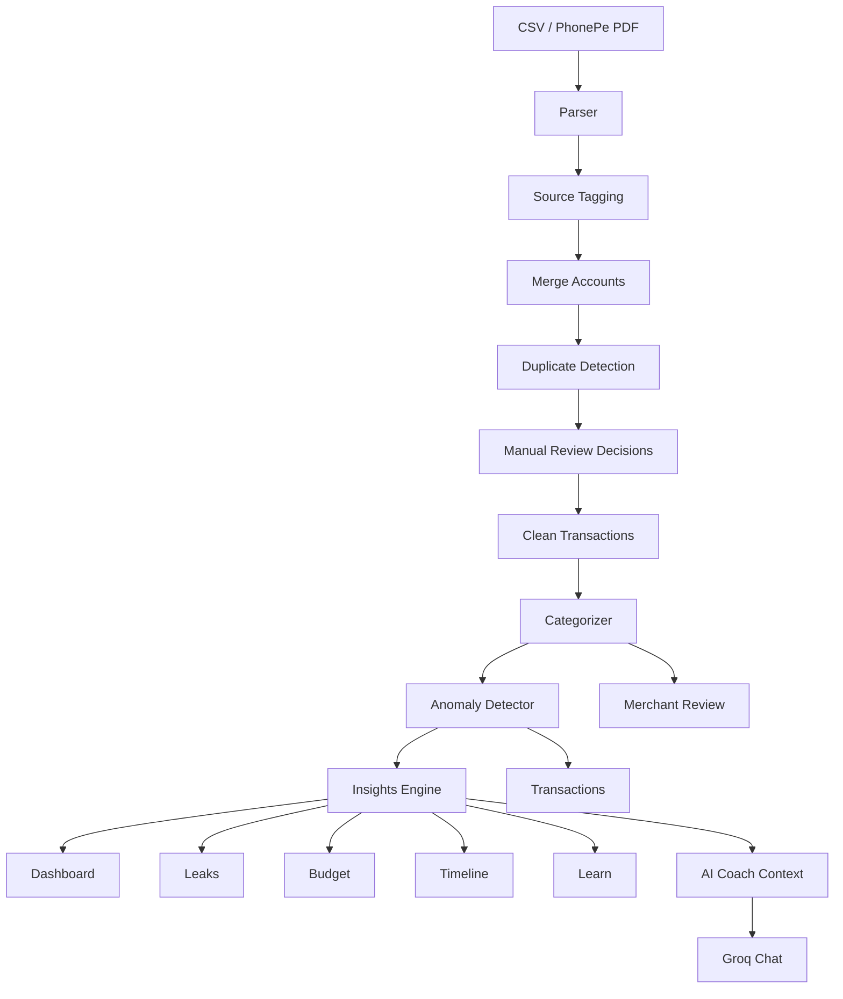

# Clarity Money OS

A personal money checkup built on UPI data.


---

## Founder Note

### The Problem

Most Indians transact entirely through UPI and have no idea where their money actually goes. Your bank app shows a list of debits. Your UPI app shows a feed. Neither tells you that you’ve spent ₹8,400 on food delivery this month, that three subscriptions you forgot about quietly renewed, or that your spending spikes every Friday night.

The data exists, every rupee timestamped with merchant names, but it’s locked in raw CSV exports that nobody reads. The people who need financial clarity the most are the ones least likely to open a spreadsheet and build it themselves.

### What I Built

Clarity Money OS takes raw UPI CSVs and PhonePe PDF statements and turns them into a complete financial picture in under a minute.

Drop in your file and you get:

- merchant categorization
- recurring payment and subscription detection
- anomaly and unusual spend flags
- silent leak cards for food drift, BNPL pressure, and forgotten subscriptions
- category budgets and month-end projections
- duplicate transaction review across multiple accounts
- a month-by-month financial timeline that reads like a story instead of a ledger
- AI-powered financial coaching using structured transaction context

The components were also designed in a way that supports a smooth mobile-first flow, since most users interacting with their finances in India do so primarily through their phones.

### Why This Approach

I considered building around open banking APIs, but they require bank partnerships and login flows that stop most users before they ever see a single insight. Screen-scraping solutions own user credentials and are increasingly difficult to trust. Manual tagging tools require effort before delivering value, which is exactly the wrong order.

The CSV-first approach works because every major Indian bank and UPI app already exports statements. The format is familiar, accessible, and private. Analytics run locally, while the AI layer only receives structured summaries instead of raw transactions. I also kept the AI optional so the core experience remains fast, explainable, and reliable without depending entirely on a model.

### What's Next

Most of the work so far has gone into the parser and normalization layer because that is where the heart of the product lives. The quality of the insights depends directly on how clean and structured the transaction data becomes.

With another month, I would:

- harden parsing across a wider variety of real-world bank exports
- add a mobile-native export/import flow
- introduce peer comparison insights
- improve merchant intelligence and recurring payment accuracy
- expand the AI layer into a longer-term behavioral finance assistant

The infrastructure is already there. It just needs to be wired.

Built solo, with guidance from my mentor along the way.

---

## Try It

- Live Demo → `YOUR_DEMO_LINK`
- Demo Video → `YOUR_VIDEO_LINK`

---

## Design Principles

- Privacy-first by default
- Useful in under a minute
- Mobile-friendly experience
- Explainable analytics over black-box scoring
- AI as augmentation, not dependency
- Local heuristics before LLMs wherever possible

---

## Features

### Statement Ingestion

- CSV upload support for bank and wallet exports
- PhonePe PDF parsing using `pdfplumber`
- Multi-account import and merge
- Flexible column alias handling for inconsistent bank formats

### Data Quality Layer

- Cross-source duplicate detection
- Manual duplicate review workflow
- Merchant extraction and cleanup
- User override rules for categorization correction

### Analytics

- Category summaries
- Top merchant analysis
- Spend velocity tracking
- Weekend vs weekday spending
- Savings rate estimation
- Month-over-month trend analysis
- Financial timeline storytelling

### Detection Systems

- Subscription and recurring payment detection
- Silent leak identification
- BNPL pressure tracking
- Frequency spike detection
- Suspicious transaction heuristics
- Unusual merchant behavior detection

### Budgeting

- Category-level budgets
- Month-end spend projections
- Budget alerts and warnings
- Overspending indicators

### AI Layer

- Structured financial context generation
- Groq-powered AI financial coaching
- Context-aware recommendations and nudges
- Optional AI integration

---

## Preview

_Add screenshots or GIFs here_

```md

```

---

## Tech Stack

### Core

- Python
- Streamlit
- pandas
- NumPy

### Visualization & Analytics

- Plotly
- SciPy

### NLP & Matching

- RapidFuzz

### Parsing

- pdfplumber

### AI

- Groq SDK

---

## Architecture



---

## Project Structure

```text
.
├── app.py
├── requirements.txt
├── MoneyOS_Logo.png
├── config/
│   ├── categories.json
│   └── user_overrides.json
├── data/
│   └── sample_transactions.csv
├── docs/
│   ├── README.md
│   └── user-manual.md
└── modules/
    ├── ai_advisor.py
    ├── anomaly_detector.py
    ├── budget_tracker.py
    ├── categorizer.py
    ├── csv_format_guide.py
    ├── deduplicator.py
    ├── insights.py
    ├── merchant_review_ui.py
    ├── parser.py
    ├── phonepe_pdf_parser.py
    ├── user_overrides.py
    └── pages/
```

---

## Installation

### 1. Clone the repository

```bash
git clone https://github.com/hitesha-sahani/UPI-Analyzer.git
cd UPI-Analyzer
```

### 2. Create a virtual environment

```bash
python -m venv venv
```

### 3. Activate the environment

#### Windows

```bash
venv\Scripts\activate
```

#### macOS / Linux

```bash
source venv/bin/activate
```

### 4. Install dependencies

```bash
pip install -r requirements.txt
```

### 5. Configure Groq (optional)

Environment variable:

```bash
set GROQ_API_KEY=your_key_here
```

Or Streamlit secrets:

```toml
GROQ_API_KEY = "your_key_here"
```

### 6. Run the app

```bash
streamlit run app.py
```

Open:

```text
http://localhost:8501
```

---

## Usage

### Explore Demo Data

Click:

```text
Explore demo first
```

### Duplicate Review Demo

Upload:

```text
data/demo_same_account_export_a.csv
```

Then add:

```text
data/demo_same_account_export_b.csv
```

This demonstrates:

- duplicate review
- account merging
- merchant categorization
- analytics
- timeline storytelling
- leak detection

### Use Your Own CSV

Recommended columns:

```csv
Date,Description,Amount,Type,UPI_ID,Balance
2024-01-02,Zomato Order,-450.00,Debit,zomato@icici,24550.00
2024-01-07,Salary Credit,85000.00,Credit,employer@hdfcbank,106342.00
```

Supported aliases include:

- `Txn Date`
- `Transaction Date`
- `Debit Amount`
- `Credit Amount`
- `Dr Amount`
- `Cr Amount`
- `Narration`
- `Particulars`
- `UPI ID`
- `VPA`
- `Reference`
- `Txn ID`

---

## Core Modules

### `modules/parser.py`

Normalizes transaction files into a common schema.

### `modules/phonepe_pdf_parser.py`

Extracts transactions from PhonePe statement PDFs.

### `modules/deduplicator.py`

Handles source tagging, merge logic, duplicate detection, and review workflows.

### `modules/categorizer.py`

Categorizes merchants using rules, overrides, and keyword mapping.

### `modules/anomaly_detector.py`

Detects unusual transaction patterns and behavioral anomalies.

### `modules/insights.py`

Generates trends, behavioral analytics, recurring payment insights, and financial summaries.

### `modules/budget_tracker.py`

Tracks category budgets, projections, and overspending alerts.

### `modules/ai_advisor.py`

Builds structured financial context for AI coaching.

---

## Pages

Current application pages:

- Dashboard
- Timeline
- Learn
- Leaks
- Transactions
- Budget
- Merchants
- AI Coach
- Duplicate Review

---

## Data Privacy

This app processes sensitive financial information.

Guidelines:

- avoid uploading real statements publicly
- never commit API keys or secrets
- keep `.streamlit/secrets.toml` private
- use sample datasets for demos when possible

Analytics primarily run locally and the AI layer only receives structured summaries instead of raw statements.

---

## Known Limitations

- PhonePe PDF parsing expects extractable text PDFs
- Some bank CSV formats may require column cleanup
- Savings rate calculations depend on income transactions being present
- AI features require Groq credentials and internet access
- Fraud/anomaly signals are heuristic and designed for awareness, not definitive fraud detection

---

## Development

### Syntax Check

```bash
python -m py_compile app.py modules\*.py modules\pages\*.py
```

### Run Locally

```bash
streamlit run app.py
```

### Add a New Page

1. Create a module in `modules/pages/`
2. Implement:

```python
render(context: PageContext) -> None
```

3. Register it in:

```text
modules/pages/__init__.py
```

4. Add the page to `nav_pages` in `app.py`

---

## Credits

Built solo as Clarity Money OS — a personal money checkup built on UPI data.
